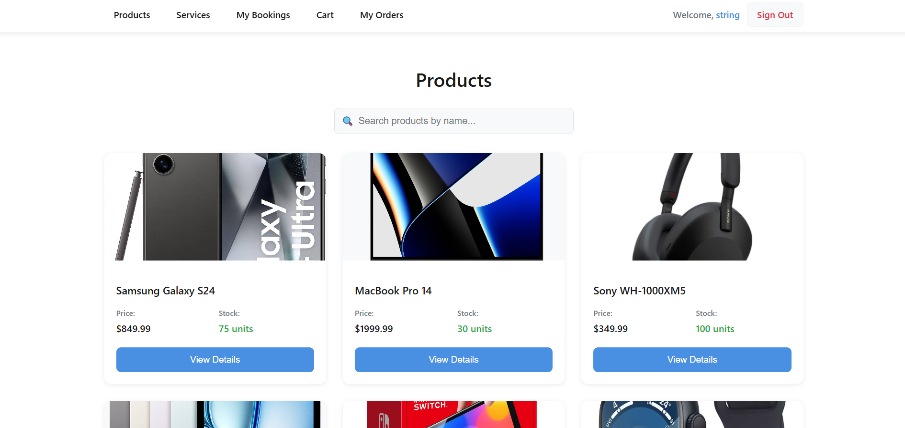

# SellFast – E-Commerce & Service Booking Platform

**SellFast** is a full-stack e-commerce platform that allows users to purchase products and book services in one place. Users can browse available items, add them to a shopping cart, and complete checkout, while admins manage products, services, and orders through protected routes.

This project was built to demonstrate a modern e-commerce workflow with authentication, role-based access, service booking with date and time selection, and order management using a scalable backend architecture.

# Getting started

Front-end Repo: *[SellFast Front-end](https://github.com/alizulfiqarbuksh/SellFast-front-end)*  
Back-end Repo: *[SellFast Back-end](https://github.com/alizulfiqarbuksh/SellFast-back-end)*

# Features

Users can:

- Register and log in using JWT authentication
- Browse available **products** and **services**
- View product and service details
- Book services by selecting a **date and time**
- Add products and services to the shopping cart
- Proceed through checkout (no payment integration yet)
- View order history and order status

Admins can:

- Create, update, and delete products
- Create, update, and delete services
- Manage user orders and order statuses
- Access admin-only routes using role-based authorization

# Authentication & Roles

- JWT-based authentication
- Role-based access control
  - **User**
  - **Admin**
- Protected routes on both frontend and backend

# Attributions

External libraries and services used:

- **FastAPI**
- **PostgreSQL**
- **pgAdmin**

# Technologies used

The technologies used to complete this project include:

- **HTML**
- **CSS**
- **JavaScript**
- **React**
- **Python**
- **FastAPI**
- **PostgreSQL**
- **pgAdmin**
- Research resources such as **Google** and **YouTube**

# Next steps

Future enhancements planned for SellFast:

- **Payment Integration**
  Add secure online payments during checkout.

- **Improved UI/UX**
  More dynamic and responsive HTML and CSS.

- **Enhanced Authentication**
  Stronger security features and improved role management.

- **User Profiles**
  Allow users to manage personal details and view detailed order history.

- **Admin Dashboard**
  Analytics and advanced management tools for admins.